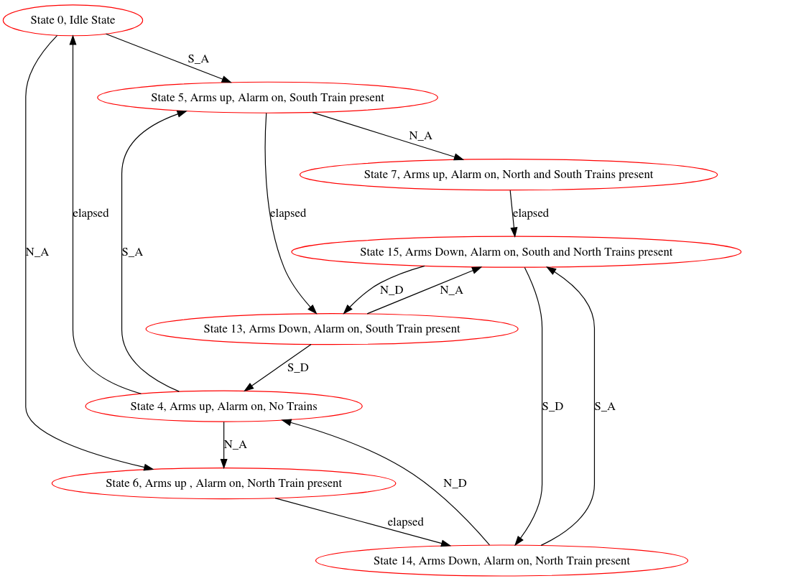

# lab09_03
This is a Finite State Machine Verification lab written by Alex Cromar, Andrew Piskadlo.
Here we have the original FSM for the railroad.

# Invariants

Here's the updated table with a number column added:

| **#** | **Invariant**                | **Description**                                                                                                                                       |
|-------|------------------------------|-------------------------------------------------------------------------------------------------------------------------------------------------------|
| 16     | Crossing Safety              | The barrier must always be lowered when a train is approaching or present. It cannot be raised while a train is detected.  |
| 17     | Alarm State                  | The alarm is either on (sounding) or off (not sounding). It must be on when a train is approaching and continue until 10 seconds after the train departs. |
| 18     | Timing Consistency           | The timer starts when the alarm is activated and ensures the barrier lowers only after the alarm has been on for 10 seconds.                           |
| 19     | Sequential Events            | The events for a train (northbound_approach and northbound_depart or southbound_approach and southbound_depart) must occur in the correct order.    |
| 20     | Exclusive States             | The barrier and alarm states must not conflict; the alarm cannot be off while the barrier is down.                                   |
| 21     | State Coherency              | The system must not transition to an unsafe state, ensuring safe sequences are followed during state changes.                                        |

# Varying invariants

We could have a scenario where a south bound train. While the system is in the arms down state we could have a northbound train. This would result in the arms being brought up before the northbound train leaves the crossing. 

# Testing Solution

| number | arms_down | alarm_on | northbound_present | southbound_present | north_approach | south_approach | north_depart | south_depart | elapsed | safety_hazard |
|--------|-----------|----------|--------------------|--------------------|----------------|----------------|--------------|--------------|---------|---------------|
| 0      | 0         | 0        | 0                  | 0                  |       6        |        5       |      19      |      19      |   18    |               |
| 1      | 0         | 0        | 0                  | 1                  |                |                |              |              |         |      16       |
| 2      | 0         | 0        | 1                  | 0                  |                |                |              |              |         |      16       |
| 3      | 0         | 0        | 1                  | 1                  |                |                |              |              |         |      16       |
| 4      | 0         | 1        | 0                  | 0                  |       6        |        5       |      19      |      19      |    0    |               |
| 5      | 0         | 1        | 0                  | 1                  |       7        |       19       |      19      |      16      |   13    |               |
| 6      | 0         | 1        | 1                  | 0                  |       19       |       19       |      16      |      19      |   14    |               |
| 7      | 0         | 1        | 1                  | 1                  |       19       |       19       |      16      |      16      |   15    |               |
| 8      | 1         | 0        | 0                  | 0                  |                |                |              |              |         |      20       |
| 9      | 1         | 0        | 0                  | 1                  |                |                |              |              |         |      20       |
| 10     | 1         | 0        | 1                  | 0                  |                |                |              |              |         |      20       |
| 11     | 1         | 0        | 1                  | 1                  |                |                |              |              |         |      20       |
| 12     | 1         | 1        | 0                  | 0                  |                |                |              |              |         |      16       |
| 13     | 1         | 1        | 0                  | 1                  |       15       |       19       |      19      |      4       |   16    |               |
| 14     | 1         | 1        | 1                  | 0                  |       19       |       15       |       4      |     19       |   16    |               |
| 15     | 1         | 1        | 1                  | 1                  |       19       |       19       |      13      |     14       |   16    |               |

| number | invariant |
|--------|-----------|
| 16     |     The barrier must always be lowered when a train is approaching or present. It cannot be raised while a train is detected or lowered when no train is present.      |
| 17     | The alarm is either on (sounding) or off (not sounding). It must be on when a train is approaching and continue until 10 seconds after the train departs.|
| 18     | The timer starts when the alarm is activated and ensures the barrier lowers only after the alarm has been on for 10 seconds.                           |
| 19     | The events for a train (northbound_approach and northbound_depart or southbound_approach and southbound_depart) must occur in the correct order.    |
| 20     | The barrier and alarm states must not conflict; the alarm cannot be off while the barrier is down.                                   |
| 21     | The system must not transition to an unsafe state, ensuring safe sequences are followed during state changes.                                        |

# Final FSM Module

This solution is very similar to our original solution. The main difference is that our solution made the assumption that trains would travel at the same speed. Our orignal solution would ignore the first train if a second train arrived because we assumed the second train would always be the last train to exit the crossing. The new solution has an extra state and can accommodate different speeds resulting in a better safer system.
